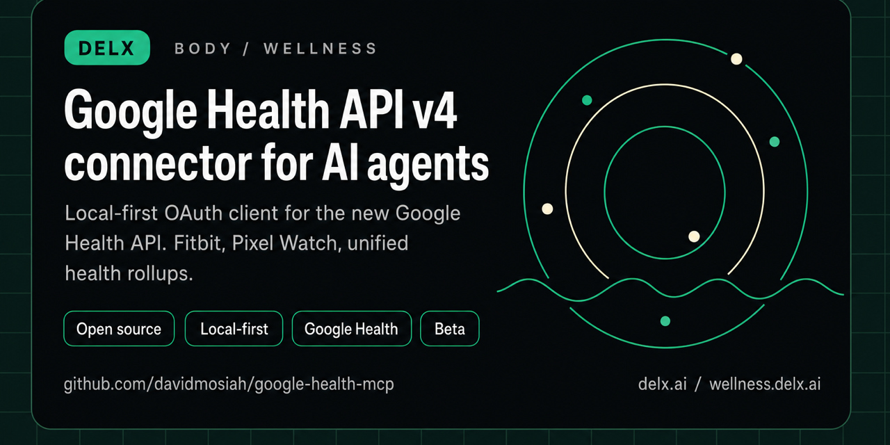

<!-- delx-wellness header v2 -->
<h1 align="center">Google Health MCP</h1>

<div align="center">
  
</div>

<h3 align="center">
  Read user-authorized Google Health API v4 data &mdash; Fitbit, Pixel Watch and partners &mdash; locally via OAuth. <strong>Beta</strong>.<br>
  Local-first MCP server &mdash; <strong>tokens never leave your machine</strong>.
</h3>

<p align="center">
  <a href="https://www.npmjs.com/package/google-health-mcp-unofficial"></a>
  <a href="https://github.com/davidmosiah/google-health-mcp/releases/latest"></a>
  <a href="https://www.npmjs.com/package/google-health-mcp-unofficial"></a>
  <a href="LICENSE"></a>
  <a href="https://wellness.delx.ai/connectors/google-health"></a>
</p>

<p align="center">
  <a href="https://github.com/davidmosiah/google-health-mcp/stargazers"></a>
  <a href="https://modelcontextprotocol.io"></a>
  <a href="https://github.com/davidmosiah/delx-wellness/blob/main/docs/release-index.md"></a>
  <a href="https://github.com/davidmosiah/delx-wellness-hermes"></a>
  <a href="https://github.com/davidmosiah/delx-wellness"></a>
</p>

> ⚡ **One-command install** with [Delx Wellness for Hermes](https://github.com/davidmosiah/delx-wellness-hermes):
> `npx -y delx-wellness-hermes setup` &mdash; preconfigures this connector and the other 8 in a dedicated Hermes profile.
>
> Or wire it standalone into Claude Desktop / Cursor / ChatGPT Desktop &mdash; see the install section below.

---

<!-- /delx-wellness header v2 -->

Unofficial, local-first MCP server for the new **Google Health API v4**.

It lets Claude, Cursor, Hermes, OpenClaw and other MCP clients read user-authorized Google Health data from Fitbit, Pixel Watch and supported third-party sources through Google's OAuth 2.0 flow.

> **Beta status:** Google recommends waiting until the end of May 2026 before officially launching Google Health API integrations because breaking changes may occur while developer feedback is incorporated. This connector is intentionally published as an early beta for builders who want to test the API now.

> **Unofficial project.** Not affiliated with, endorsed by or supported by Google, Fitbit or Alphabet. Not a medical device. Not medical advice.

## Beta Testers Wanted

The highest-leverage contribution right now is real setup feedback from Fitbit, Pixel Watch, Android and Google Health API v4 users.

If you can test with a real account:

- Run `npx -y google-health-mcp-unofficial doctor` and confirm the OAuth flow is clear.
- Try `google_health_connection_status`, `google_health_data_inventory` and `google_health_daily_summary` from your MCP client.
- Open an issue for missing data types, confusing setup steps, client-specific friction or privacy concerns.
- Do **not** paste OAuth tokens, client secrets or personal health measurements into public issues.

Useful links:

- [Beta testers wanted](https://github.com/davidmosiah/google-health-mcp/issues/2)
- [Data coverage validation](https://github.com/davidmosiah/google-health-mcp/issues/3)
- [MCP client setup feedback](https://github.com/davidmosiah/google-health-mcp/issues/4)
- [Demo](docs/demo.md)
- [Discovery kit](docs/discovery.md)

## Why this exists

Google Health API is the successor to Fitbit Web API: new OAuth, new base URL, v4 endpoint schema, standardized data types, reconciled streams and rollups.

This MCP gives agents a clean way to discover the API, check setup, authenticate locally and query data without pasting tokens into prompts or agent configs.

## 30-second Demo

<p align="center">
  
</p>

```bash
npx -y google-health-mcp-unofficial setup --scope-preset full
npx -y google-health-mcp-unofficial auth
npx -y google-health-mcp-unofficial doctor
```

Then start your agent with:

- `google_health_connection_status`
- `google_health_data_inventory`
- `google_health_privacy_audit`
- `google_health_daily_summary`

## Install

Create a Google Cloud OAuth client, enable the Google Health API, and add:

```text
http://127.0.0.1:3000/callback
```

Then run:

```bash
npx -y google-health-mcp-unofficial setup --scope-preset full
npx -y google-health-mcp-unofficial auth
npx -y google-health-mcp-unofficial doctor
```

Scope presets keep OAuth consent easier to reason about:

```bash
npx -y google-health-mcp-unofficial setup --scope-preset basic
npx -y google-health-mcp-unofficial setup --scope-preset activity
npx -y google-health-mcp-unofficial setup --scope-preset sleep
npx -y google-health-mcp-unofficial setup --scope-preset full
```

- `basic` - profile and settings only
- `activity` - profile, settings, activity and health metrics
- `sleep` - profile, settings and sleep
- `full` - all recommended read-only scopes, including nutrition

If setup gets stuck:

```bash
npx -y google-health-mcp-unofficial doctor --fix
npx -y google-health-mcp-unofficial doctor --live
npx -y google-health-mcp-unofficial support --redacted
```

- `doctor --fix` repairs local config/token permissions where the OS supports `chmod 600`.
- `doctor --live` calls safe Google Health identity/profile/settings endpoints after auth to prove the API is reachable.
- `support --redacted` prints a copy-paste support bundle for GitHub issues without tokens, secrets or health measurements.

Recommended read-only scopes:

```text
https://www.googleapis.com/auth/googlehealth.profile.readonly
https://www.googleapis.com/auth/googlehealth.settings.readonly
https://www.googleapis.com/auth/googlehealth.activity_and_fitness.readonly
https://www.googleapis.com/auth/googlehealth.health_metrics_and_measurements.readonly
https://www.googleapis.com/auth/googlehealth.sleep.readonly
https://www.googleapis.com/auth/googlehealth.nutrition.readonly
```

Standalone MCP config:

```json
{
  "mcpServers": {
    "google_health": {
      "command": "npx",
      "args": ["-y", "google-health-mcp-unofficial"]
    }
  }
}
```

## Tools

Start here:

- `google_health_connection_status` - local config, token, scope and client readiness
- `google_health_data_inventory` - supported domains, scopes, data type naming and agent flow
- `google_health_agent_manifest` - machine-readable install/runtime guide
- `google_health_daily_summary` - daily beta summary from rollups and reconciled streams
- `google_health_weekly_summary` - weekly beta review

Google Health API methods:

- `google_health_get_identity`
- `google_health_get_profile`
- `google_health_get_settings`
- `google_health_list_data_points`
- `google_health_reconcile_data_points`
- `google_health_daily_rollup`
- `google_health_rollup`

Diagnostics:

- `google_health_get_auth_url`
- `google_health_exchange_code`
- `google_health_privacy_audit`
- `google_health_cache_status`
- `google_health_revoke_access`
- `google_health_wellness_context`

## Data Type Notes

Endpoint paths use kebab case:

```text
steps
sleep
heart-rate
daily-resting-heart-rate
daily-heart-rate-variability
active-zone-minutes
total-calories
weight
exercise
```

Filter expressions use snake case:

```text
steps.interval.civil_start_time >= "2026-05-07"
heart_rate.sample_time.physical_time >= "2026-05-07T00:00:00Z"
sleep.interval.civil_start_time >= "2026-05-07"
```

Source families supported by the API:

```text
users/me/dataSourceFamilies/all-sources
users/me/dataSourceFamilies/google-wearables
users/me/dataSourceFamilies/google-sources
```

## Privacy

- OAuth tokens are stored locally at `~/.google-health-mcp/tokens.json` with `0600` permissions.
- Secrets can live in `~/.google-health-mcp/config.json` or `GOOGLE_HEALTH_*` environment variables.
- Tools never return access tokens, refresh tokens or client secrets.
- `GOOGLE_HEALTH_PRIVACY_MODE=structured` is the default.
- `raw` mode is explicit and should be used only for debugging or deep analysis.

## Hermes

```bash
npx -y google-health-mcp-unofficial setup --client hermes --no-auth
npx -y google-health-mcp-unofficial auth
npx -y google-health-mcp-unofficial doctor --client hermes --fix
npx -y google-health-mcp-unofficial doctor --client hermes --live
hermes mcp test google_health
```

After config changes, use `/reload-mcp` or `hermes mcp test google_health`. Do not restart the gateway for normal data access.

## Development

```bash
git clone https://github.com/davidmosiah/google-health-mcp.git
cd google-health-mcp
npm install
npm test
```

## Links

- Google Health API: https://developers.google.com/health
- REST reference: https://developers.google.com/health/reference/rest
- Scopes: https://developers.google.com/health/scopes
- Data types: https://developers.google.com/health/data-types
- Migration guide: https://developers.google.com/health/migration
- Delx Wellness registry: https://github.com/davidmosiah/delx-wellness

## 📧 Contact & Support

- 📨 **support@delx.ai** — general questions, integration help, partnerships
- 🐛 **Bug reports / feature requests** — [GitHub Issues](https://github.com/davidmosiah/google-health-mcp/issues)
- 🐦 **Updates** — [@delx369](https://x.com/delx369) on X
- 🌐 **Site** — [wellness.delx.ai](https://wellness.delx.ai)


## License

MIT - see [LICENSE](LICENSE).
